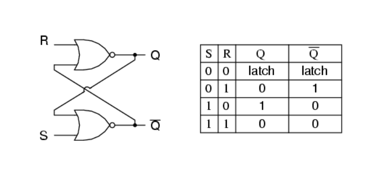
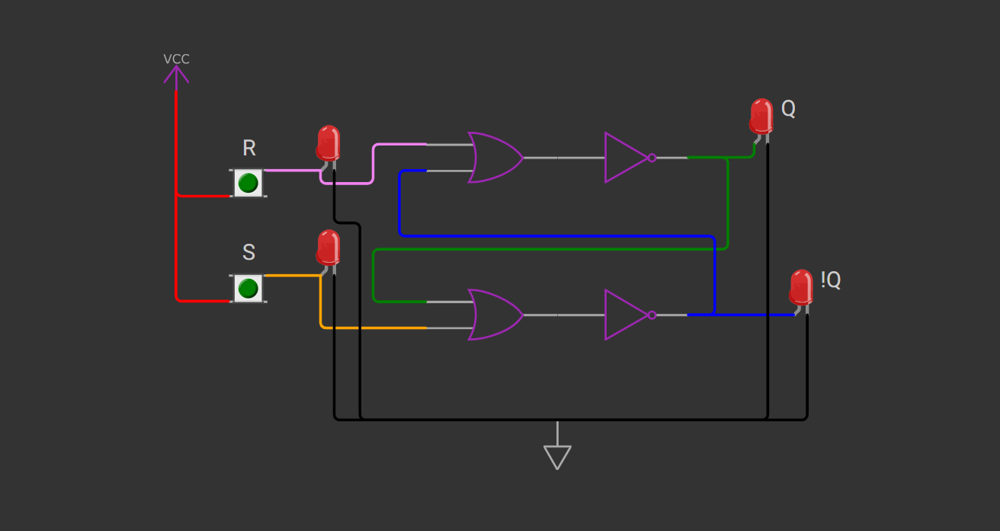

# SR_Latch
A repository for SR latch circuits, simulations, and implementations.

## Introduction
The **SR Latch** (Set-Reset Latch) is a fundamental sequential circuit in digital electronics used for storing binary information.

## Circuit Diagram

## Truth Table
| S | R |   | Q |  | Q' |
|---|---|   |---|  |----|
| 0 | 0 |   |Qprev||Q'prev |
| 0 | 1 |   |0 |   | 1 |
| 1 | 0 |   |1 |   | 0 |
| 1 | 1 |   |Undef||Undef |

